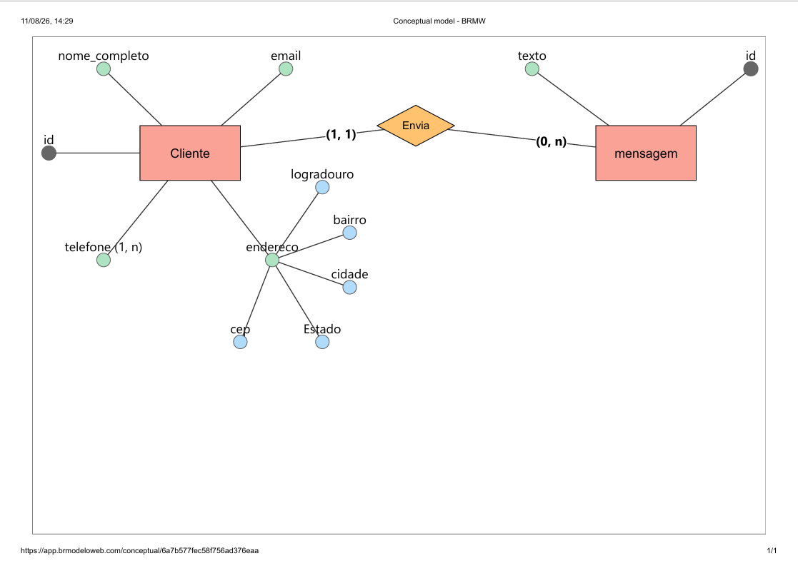

# Projeto de Banco de Dados
**Nome do Projeto**: Site da confeitaria Sempre Doce
**Equipe de Desenvolvimento**: Mayara Caetano

## 1. Visão Geral do Sistema (Escopo)
A **Confeitaria Sempre Doce** deseja expandir sua atuação criando um site para vender seus produtos, estes são feitos com muito amor e carinho mantendo a tradição da sua família.

## 2. Requisitos Funcionais (RF)

**RF01**: O sistema deve gerenciar o cadastro de seus clientes, as informações úteis que foram levantadas são:

 - Nome Completo
 - Telefone
 - E-mail
 - Endereço (logradouro, bairro, estado, cep, cidade)

 ## Modelagem Conceitual 

 **RF02**: O sistema deve permitir que o cliente envie uma mensagem com as informações do seu pedido,  a mensagem será enviada via formulário do sistema preenchendo os seguintes campos: 
 
 - Nome
 - E-mail 
 - Telefone 
 - Endereço
 - Texto da mensagem 
